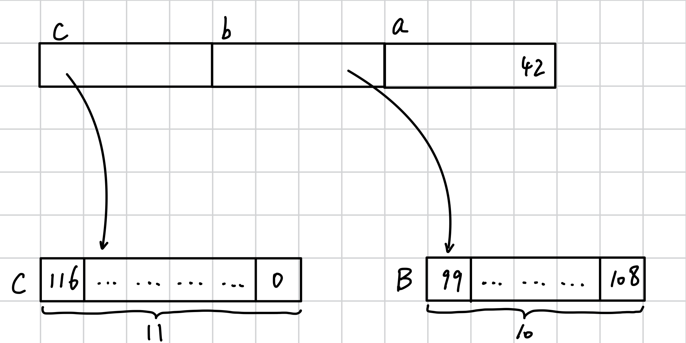

# 1.1 Pointer Overview (Part 1) - What Is a Pointer, and the Difference Between Pointers and References

## 1.1.1. What Is a Pointer
***A pointer is a way for a computer to reach data that cannot be accessed directly right away.***

A very intuitive analogy is a book’s table of contents. The table of contents is like a pointer, and what it stores is the page number where the corresponding content lives. In a computer, a pointer stores an address. In a book, we can use the page number in the table of contents to find the content we want; in a computer, we use the address stored in the pointer to find the data we want to access. The figure below gives a vivid description of pointers:


Data in physical memory (Random Access Memory, or RAM) is stored in a scattered way. To find specific data, we need a **lookup system**, called an **address space**.

Pointers are encoded as memory addresses and represented as integers of type `usize` (the reason for using `usize` will be explained when we talk about virtual memory; see [1.7.3. Virtual Memory](../1.7/1.7._Memory_Part_5_-_Heap_vs._Stack_Memory,_Virtual_Memory,_and_Guidelines_for_Displaying_Data_in_RAM.md)). An *address* points to a certain location within the address space.

The range of the address space is a *facade* provided by the system and the CPU: it is a simplified outward-facing interface that hides the complex internal details. A program only knows about an ordered sequence of bytes and does not consider the actual amount of RAM in the system.

## 1.1.2. Terminology
- A memory address (also called an address) is a number that refers to a single byte in memory. A memory address is an abstraction provided by assembly language.
- A pointer (also called a raw pointer) is a memory address to a certain type. A pointer is an abstraction provided by a high-level language.
- A reference: here, this refers to a Rust reference (see [Rust Guide 4.4. Reference and Borrowing](https://someb1oody.github.io/RustGuide/en/Chapter-04/4.4/4.4._Reference_and_Borrowing.html)). It is a pointer, but if it points to dynamically sized data, such as `str` or `[T]`, the reference also carries enough information to know where the data ends so that out-of-bounds access can be prevented. A reference is an abstraction provided by the Rust language.

## 1.1.3. References in Rust
Compared with raw pointers, Rust references have many advantages:
- A reference always refers to valid data.

- A reference is aligned to the alignment requirement of the type it points to; if it is not aligned, CPU operations will be slower. Rust uses padding bytes to ensure references are properly aligned in memory.
  *Alignment* means that the storage address of data in memory must be a multiple of a certain value to satisfy hardware access requirements and improve efficiency. In Rust, a reference such as `&T` or `&mut T` is aligned according to the alignment of `T`, not necessarily `usize`. For example, on a 64-bit system, `usize` is 8 bytes, but a reference to a `u8` only needs 1-byte alignment. If a value’s address is `0x1001`, whether it can be used as a reference depends on the alignment requirement of the referenced type, not on whether it is a multiple of `usize`.

- References can provide the same guarantees for dynamically sized types. For types without a fixed length in memory, Rust ensures that enough metadata is stored with the pointer so that the boundary of the data is known and out-of-bounds access is prevented.

## 1.1.4. Rust References and Pointers
Let’s look at an example:
```rust
static B: [u8; 10] = [99, 97, 114, 114, 121, 116, 111, 119, 101, 108];
static C: [u8; 11] = [116, 104, 97, 110, 107, 115, 102, 105, 115, 104, 0];

fn main() {
    let a:i32 = 42;
    let b:&[u8;10] = &B;
    let c:&[u8;11] = &C;
    println!("a = {}, b = {:p}, c = {:p}", a, b, c);
}
```
- `b` is a reference to `B`, and `c` is a reference to `C`.
- `{:p}` means printing the variable’s memory address.

Output:
```
a = 42, b = 0x1021d97e0, c = 0x1021d97ea
```

The local memory layout of `a`, `b`, and `c` looks like this:



- Variables `b` and `c` are references. On a 32-bit CPU they occupy 4 bytes, and on a 64-bit CPU they occupy 8 bytes (here they are 4 bytes).
- `a` is of type `i32`, so it occupies 4 bytes in memory.
- The static variables `B` and `C` are arrays, and their elements are `u8`, so each element occupies 1 byte.

What this code is trying to do is make `b` resemble a smart pointer and `c` resemble a raw pointer. The example is still not close enough, and we’ll have a more realistic one later. For now, let’s work with this.


This is a fictional 49-byte address space that represents the ideal effect we want to achieve, so it differs from the code above. Let’s go through it step by step:
- `a` is an integer, but because the diagram shows the idealized case, the type in the diagram is `i16` (2 bytes), not the original `i32`.
- `b` is a smart pointer with a total length of 4 bytes. Its address field only takes 2 bytes, that is, `u16`. The length field also takes 2 bytes. Because `B` is an array with 10 elements, the value stored in the length field is 10. The address field stores 32, which is the starting position of the data, namely `0x20` (32 in hexadecimal is `0x20`). Since the length is 10, the data range is from `0x20` to `0x29`.
- `c` is a raw pointer and takes 2 bytes. The bytes store only the address. Here it stores 16, which is `0x10` in hexadecimal, so `c` points to data starting at `0x10`. Since it contains 11 elements, it points to the block from `0x10` to `0x1A`.
- `0x0` is the null byte. It is a dead zone for the program. If a pointer points here and is dereferenced, the program will crash.

Other notes:
- Variable `c` is a null-terminated buffer. In fact, this is the internal representation of strings in C (C strings are arrays terminated by `0`). Knowing how to convert these types to Rust types is very useful when handling external code through *the Foreign Function Interface (FFI, which will be discussed in detail later)*.
- Variable `c` together with `C` is what Rust calls a `CStr`.
- Variable `b` is actually a fixed-length buffer of 10 bytes, but it has no terminator (it does not end in `0`). When this buffer appears after a pointer type, it is called a *backing array*.
- Variable `b` together with `B` can almost form Rust’s string type, but Rust strings also include a capacity field. In other words, a Rust string type needs three fields: length, address, and capacity.
