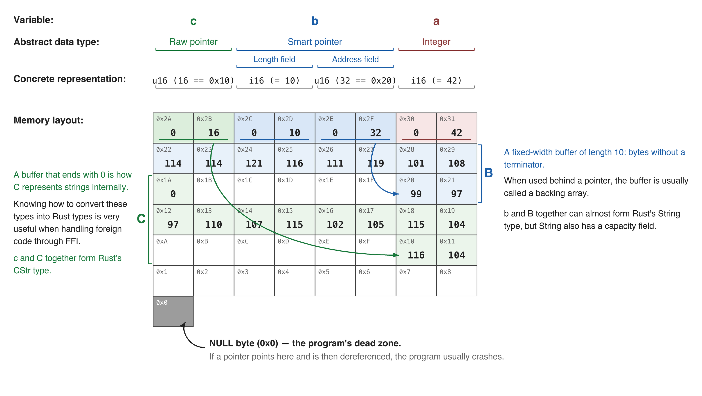

# 1.2 Pointer Overview (Part 2) - Raw Pointers and the Different Kinds of Pointers in Rust

## 1.2.1. A Quick Review
In the [previous section](../1.1/1.1._Pointer_Overview_(Part_1)_-_What_Is_a_Pointer,_and_the_Difference_Between_Pointers_and_References.md), we used references to simulate pointers, but the result was much less accurate than we wanted. What we want is to distinguish the internal differences between raw pointers and smart pointers, specifically as follows:



I explained this diagram in detail in the previous article, [1.1. Pointer Overview (Part 1)](../1.1/1.1._Pointer_Overview_(Part_1)_-_What_Is_a_Pointer,_and_the_Difference_Between_Pointers_and_References.md), so I will not repeat it here.

## 1.2.2. References and Pointers in Rust
In this article, we will use a more realistic example with more complex types to show the differences inside pointers:
```rust
use std::mem::size_of;

static B: [u8; 10] = [99, 97, 114, 114, 121, 116, 111, 119, 101, 108];
static C: [u8; 11] = [116, 104, 97, 110, 107, 115, 102, 105, 115, 104, 0];

fn main() {
    let a: usize = 42;
    let b: Box<[u8]> = Box::new(B);
    let c: &[u8; 11] = &C;

    println!("a (unsigned integer)");
    println!("address: {}", &a);
    println!("size: {:?} bytes", size_of::<usize>());
    println!("value: {:?}\n", a);

    println!("b (inside a Box)");
    println!("address: {:p}", &b);
    println!("size: {:?} bytes", size_of::<Box<[u8]>>());
    println!("points to: {:p}\n", b.as_ptr());

    println!("c (reference to C)");
    println!("address: {:p}", &c);
    println!("size: {:?} bytes", size_of::<&[u8; 11]>());
    println!("points to: {:p}\n", c);

    println!("B (10-byte array):");
    println!("address: {:p}", &B);
    println!("size: {:?} bytes", size_of::<[u8; 10]>());
    println!("value: {:?}\n", B);

    println!("C (11-byte array):");
    println!("address: {:p}", &C);
    println!("size: {:?} bytes", size_of::<[u8; 11]>());
    println!("value: {:?}\n", C);
}
```
- The `std::mem::size_of` function is used to obtain the memory size occupied by each type, measured in bytes.
- The static variables `B` and `C` have the same sizes and contents as in the [previous article](../1.1/1.1._Pointer_Overview_(Part_1)_-_What_Is_a_Pointer,_and_the_Difference_Between_Pointers_and_References.md).
- `a` is of type `usize` and has the value 42.
- `b` wraps `B` in the smart pointer `Box<T>`, and ownership of the value inside `Box<T>` is transferred to `Box<T>`.
- `c` is a normal reference.
- Each variable’s address is printed using the address-of operator `&`; each variable’s size in bytes is also printed using `std::mem::size_of`.
- We printed `a`, `b`, `c`, `B`, and `C`, but because their types differ, the meaning of their printed representations also differs: `a`, `B`, and `C` print the actual stored value, while the `points to:` lines for `b` and `c` print the address of the data they refer to (`b.as_ptr()` and `{:p}` on `c`).
- The `address:` label for `a` in the code is misleading as written; `println!("address: {}", &a);` displays the value of `a` through `Display`, not its address. To print the address itself, use `{:p}`.

Output:
```
a (unsigned integer)
address: 42
size: 8 bytes
value: 42

b (inside a Box)
address: 0x16d1aa5f0
size: 16 bytes
points to: 0x1031f1c10

c (reference to C)
address: 0x16d1aa600
size: 8 bytes
points to: 0x102c8aeba

B (10-byte array):
address: 0x102c8aeb0
size: 10 bytes
value: [99, 97, 114, 114, 121, 116, 111, 119, 101, 108]

C (11-byte array):
address: 0x102c8aeba
size: 11 bytes
value: [116, 104, 97, 110, 107, 115, 102, 105, 115, 104, 0]
```
- My computer is 64-bit, so `a`, which is a `usize`, occupies 8 bytes of memory.
- `b` is of type `Box<T>`, a smart pointer, so it occupies 16 bytes — the size of two `usize` values (one `usize` field stores the pointer, and the other stores the length/capacity metadata needed for a slice-backed box).
- `c` is a normal reference, i.e. a pointer, so it occupies 8 bytes — the size of one `usize` value (used to store the pointer).
- `B` is an array with 10 elements of type `u8`; since one `u8` occupies one byte, the array occupies 10 bytes.
- `C` is an array with 11 elements of type `u8`; since one `u8` occupies one byte, the array occupies 11 bytes.

What we really need to pay attention to are the pointers stored in `c` and `b`:
- `c` stores a pointer to `C`. In the output, we can see that the pointer stored in `c` is `0x102c8aeba`, and the address where `C` resides is exactly `0x102c8aeba`, so they match.
- `b` stores a pointer to the *heap copy* of `B`’s bytes (created by `Box::new(B)`). The pointer stored in `b` is `0x1031f1c10`, but the address where the static `B` resides is `0x102c8aeb0`, so they do not match. Why is that?
  Because `B` is stored in static memory, while `Box<[u8]>` allocates a separate buffer on the heap and copies the array there. So `b` does not point at the static `B`; it points at the heap allocation.

Let’s look at another example. We will still use the same static variables `B` and `C`. In the [previous article](../1.1/1.1._Pointer_Overview_(Part_1)_-_What_Is_a_Pointer,_and_the_Difference_Between_Pointers_and_References.md), we explained that `B` and `C` are actually textual content, but they have not been decoded, so they are stored as `u8` values. Here, we will implement the decoding operation. This also allows us to create a memory layout that is even closer to the ideal state (the one shown in the diagram in 1.2.1. A Quick Review):
```rust
use std::borrow::Cow;
use std::ffi::CStr;
use std::os::raw::c_char;

static B: [u8; 10] = [99, 97, 114, 114, 121, 116, 111, 119, 101, 108];
static C: [u8; 11] = [116, 104, 97, 110, 107, 115, 102, 105, 115, 104, 0];

fn main() {
    let a = 42;
    let b: String;
    let c: Cow<str>;

    unsafe {
        let b_ptr = &B as *const u8 as *mut u8;
        b = String::from_raw_parts(b_ptr, 10, 10);

        let c_ptr = &C as *const u8 as *const c_char;
        c = CStr::from_ptr(c_ptr).to_string_lossy();
    }

    println!("a: {}, b: {}, c: {}", a, b, c);
}
```
- `std::borrow::Cow` is a smart pointer. `Cow` stands for Clone on Write, which means cloning only happens when a write is needed; if you only need to read, cloning is unnecessary.

- `std::ffi::CStr` is similar to a C string type; it allows Rust to read strings terminated by `0`.

- `std::os::raw::c_char` is an alias for the platform’s C `char` type (often `i8`, sometimes `u8`). Prefer `std::ffi::c_char` in modern code.

- The variables `a`, `b`, and `c` in `main` are of types `i32`, `String`, and `Cow<str>`, respectively.

- Because the operations below need raw pointers — such as mutable raw pointers `*mut T` and immutable raw pointers `*const T` — they must be placed inside an `unsafe` block:

  - The first step is to obtain a mutable raw pointer to `B`, that is, convert it to `*mut u8`. But we obviously cannot get that directly, so we first write `&B` to obtain a reference to `B`, then use `as *const u8` to convert it to an immutable raw pointer to `u8`, and finally use `as *mut u8` to convert it to a mutable raw pointer.

  - Why do we need a mutable raw pointer? Because we need to use `String::from_raw_parts` to decode the numbers into text. It takes three parameters: `buf`, `length`, and `capacity` (corresponding to the three fields of the smart pointer `String`). For `buf`, we pass the raw pointer `b_ptr`; for `length` and `capacity`, we pass `10`, because we know there are 10 elements. After this step, the string corresponding to `B` has been decoded.

  - We perform a similar operation on `C`, but with one difference: `C` ends with element `0`, which is how C stores strings, so the code for decoding `C` is slightly different. We need an immutable raw pointer to `C`, and the type must also be changed from `u8` to `c_char` (platform-dependent, often `i8`). So we first write `&C` to obtain a reference, then `as *const u8` to obtain a raw pointer, and finally `as *const c_char` to change the type to `c_char`.

  - Using `CStr::from_ptr`, we pass in `c_ptr`, the immutable raw pointer to `C` of type `i8`, and then use the `to_string_lossy` method to get the decoded string.

- Finally, we print `a`, `b`, and `c`.

Output:
```
a: 42, b: carrytowel, c: thanksfish
```
- The printed line is:
  - `a` prints as 42 directly.
  - `b` decodes to `carrytowel`.
  - `c` decodes to `thanksfish`.

- After printing, the process still aborts when `b` is dropped. On some platforms you may also see allocator diagnostics (for example macOS `malloc: *** error for object ...: pointer being freed was not allocated`); on this run the abort produced no extra stderr text.

*This happens because `String::from_raw_parts` takes ownership of memory that must have been allocated by the allocator; here we are pointing it at static data, so the allocator tries to free memory it does not own.*

## 1.2.3. Raw Pointer
### What Is a Raw Pointer
Unsafe Rust provides two pointer-like types similar to references, called *raw pointers*. In English, they are called raw pointers. Only *using raw pointers* needs to be placed inside an `unsafe` block, because problems may occur. *Creating a raw pointer by itself* does not cause problems, so it does not need to be inside `unsafe`.

Like references, raw pointers can be mutable or immutable:
- Mutable: `*mut T`
- Immutable: `*const T`, which means you cannot mutate the pointed-to value through this pointer (without first casting it to `*mut T`).
*Note: the `*` here is part of the type and does not mean dereference. The three tokens `*const T` together form a type, such as `*const String`.*

`*const T` and `*mut T` differ very little and can be freely converted into one another. Rust references (whether `&mut T` or `&T`) are converted into raw pointers by the compiler at compile time, which means **you can get the performance of raw pointers without entering an `unsafe` block**.

The differences between references and raw pointers are:
- Raw pointers can ignore the borrow rules by allowing *both mutable and immutable pointers at the same time* or *multiple mutable pointers to the same location* (see [Rust Guide 4.4. Reference and Borrowing](https://someb1oody.github.io/RustGuide/en/Chapter-04/4.4/4.4._Reference_and_Borrowing.html) for the borrow rules).
- Raw pointers cannot guarantee that they point to valid memory, while references can.
- Raw pointers may be `null`.
- Raw pointers do not implement any automatic cleanup.

Let’s look at a simple example of converting to a raw pointer (the previous example was a bit more complicated):
```rust
fn main(){
    let a: i64 = 42;
    let a_ptr: *const i64 = &a as *const i64;

    println!("a: {}({:p})", a, a_ptr);
}
```

Output:
```
a: 42(0x16f30a620)
```

### Dereference
Dereferencing refers to the process by which a pointer extracts data from RAM; this is called *dereferencing a pointer*.

Let’s look at another example that converts a reference into a raw pointer:
```rust
fn main() {
    let a: i64 = 42;
    let a_ptr: *const i64 = &a as *const i64;
    let a_addr: usize = unsafe { std::mem::transmute(a_ptr) };

    println!("a: {}({:p}..0x{:x})", a, a_ptr, a_addr + 7);
}
```
- `a` is of type `i64`, and its value is 42.
- `a_ptr` is the immutable raw pointer to `a`.
- Inside the `unsafe` block, `a_addr` uses `std::mem::transmute` to convert `a_ptr` into `usize` (code involving raw pointers must be placed inside an `unsafe` block).
- When printing, we first print the value of `a`, then the raw pointer to `a`, and finally the value of `addr + 7`.

Output:
```
a: 42(0x16d9ea608..0x16d9ea60f)
```

### A Few Reminders About Raw Pointers
- At the lowest level, references (`&mut T` and `&T`) are ultimately implemented as raw pointers. But references carry extra guarantees and should always be your first choice.
- Accessing the value of a raw pointer is always unsafe.
- Raw pointers do not own the value they point to, and the compiler does not check whether the data is valid when you access it.
- Rust allows multiple raw pointers to point to the same data, but it cannot guarantee the validity of the shared data.

### When Raw Pointers Are Used
Sometimes raw pointers have to be used, for example:
- Some system or third-party libraries require them, such as when interoperating with C.
- When shared access to certain data is essential and runtime performance requirements are high.

## 1.2.4. The Rust Pointer Ecosystem
- Raw pointers are unsafe.
- Smart pointers tend to wrap raw pointers and add more capabilities (semantics). In other words, they do more than just dereference memory addresses; they also provide other capabilities, as follows:

| Name | Summary | Strengths | Weaknesses |
| ---- | ------- | --------- | ---------- |
| Raw Pointer | `*mut T` and `*const T`; the most basic building block, lightning fast, extremely unsafe | Speed, interoperability | Unsafe |
| `Box<T>` | Can put anything inside a `Box`. Suitable for long-term storage of almost any type. A main force in the new era of safe programming. | Stores values on the heap in a centralized way | Increased size |
| `Rc<T>` | Rust’s capable and wise bookkeeper. It knows who borrowed what and when. | Shared access to values | Increased size; runtime cost; not thread-safe |
| `Arc<T>` | Rust’s ambassador. It can share values across threads and ensure they do not interfere with one another. | Shared access to values; thread-safe | Increased size; runtime cost |
| `Cell<T>` | An expert in “changing state,” with the ability to change an immutable value | Interior mutability; same size as `T` | Not thread-safe; no direct references to the inner value |
| `RefCell<T>` | Allows mutation through immutable references, but at a cost | Interior mutability; can be nested with `Rc` and `Arc` | Increased size; runtime cost; not thread-safe; lacks compile-time guarantees |
| `Cow<T>` | Encapsulates borrowed data and provides immutable access, while cloning lazily when modification or ownership is needed | Avoids writes during read-only access | Size may grow |
| `String` | Handles variable-length text and shows how to build safe abstractions | Grows dynamically on demand; runtime guarantees correct encoding | Over-allocates memory |
| `Vec<T>` | The most commonly used storage structure in programs; it preserves ownership when values are created and destroyed | Grows dynamically on demand | Over-allocates memory |
| `RawVec<T>` | The foundation of `Vec<T>` and its dynamically sized types; knows how to provide a home for data on demand | Grows dynamically on demand; works with the allocator to find space | **Not directly intended for your code** |
| `Unique<T>` | The sole owner of a value, guaranteeing full control | The basis for types that need exclusive ownership, such as `String` | **Not intended for direct use in application code** |
| `NonNull<T>` | A non-null raw pointer wrapper used inside many standard smart pointers | Covariance over `T`; niche optimization with `Option<NonNull<T>>` | Still unsafe to dereference; **usually not used directly in application code** |
