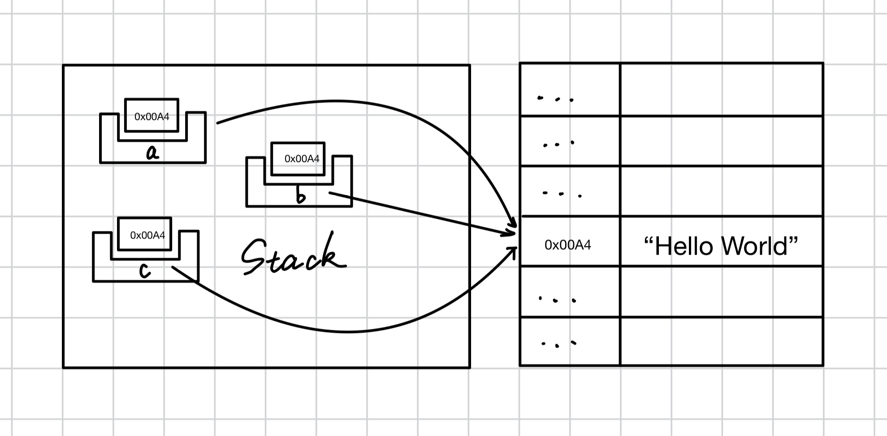
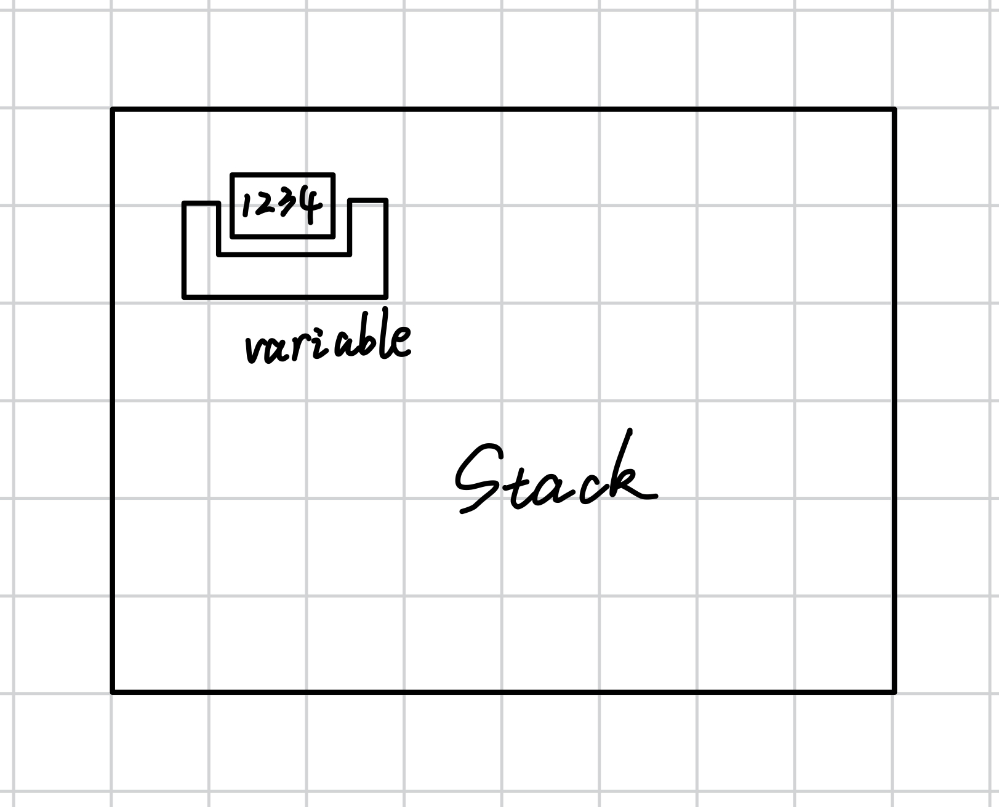

# 1.3 Memory Part 1 - Definitions of Concepts and the High-Level and Low-Level Models of Variables

## 1.3.1. Value
Before talking about memory, we need to define three concepts. The first is value. A value means *type + one element from that type’s value space*.

For example, `true` has the type `bool`, and its value space contains two values: `true` and `false`. A value means *type + one element from that type’s value space*. The value of `true` is *the `bool` type + the value-space element `true`*.

*A value can be represented as a byte sequence through its type representation*:
- For example, the value `6` of type `u8` is represented in memory as `0x06`.
- Another example is the string `"Hello World"` of type `str`. It is one value in the value space of strings, and its representation is UTF-8 encoded.
*Note: the meaning of a value is independent of the location of the bytes that store it. In other words, a value and the place where it is stored are not directly related; they are two separate concepts.*

## 1.3.2. Variable
A value is stored somewhere — or more precisely, somewhere that can hold a value. The most common place to store a value is a variable, which is a named slot on the *stack* used to store values.


## 1.3.3. Pointer
A pointer is a value whose contents store the address of a piece of memory. A pointer points to a certain place, namely the memory corresponding to that address.

A pointer can be *dereferenced* to access the value stored in the memory it points to.

The same pointer can be placed in different variables. In other words, multiple variables can indirectly refer to the same region of memory, that is, the same underlying value.



## 1.3.4. Going Deeper Into Variables
Variables can be divided into two models:
- High-level model: lifetimes, borrowing, ...
- Low-level model: unsafe code, raw pointers, ...

### The High-Level Model of Variables
*A variable is essentially a name given to a value.* When a value is assigned to a variable, that value is named by that variable from then on.

For example:
```rust
let variable = 1234;
```



As shown in the diagram, the data `1234` is now named by the variable `variable`.

When a variable is accessed, you can draw a line from the last access to the current access to establish a dependency between the two accesses. If a variable has been moved, then you can no longer draw such a line from it.

That may sound unclear, so let’s look at a diagram:


Declaring `a` (line 2) counts as one access, assigning `a` to `b` (line 4) counts as another, but you cannot draw a line between that and printing `a` (line 8), because the variable has already been moved before that (line 4).

*In the high-level model of variables*, a variable exists only while it holds a valid value. If a variable’s value has not been initialized, or has already been moved, then the line-drawing method cannot be used.

Using this model, the whole program consists of many dependency lines. These lines are called *flows*. Each flow tracks the lifetime of a specific instance of a value. When branches exist, flows can split or merge, and each branch tracks a different lifetime of that value.

At any given point in the program, the compiler can check whether all flows are mutually compatible and can coexist in parallel. For example:
- A value cannot have two parallel flows with mutable access.
- A flow borrows a value without any flow owning that value.

### The Low-Level Model of Variables
Variables name memory addresses that may or may not store valid values.

You can think of a variable as a slot for a value: when you assign to it, the slot becomes filled, and the old value inside it, if any, is discarded or replaced. When you access it, the compiler checks whether the slot is empty. If it is, then the variable is said to be uninitialized or its value has been moved.

*A pointer to a variable is actually a pointer to the underlying memory of that variable*. By dereferencing it, you can obtain its value.

**Note: in this example, we ignore CPU registers and treat them as an optimization detail. In reality, if a variable does not need a memory address, the compiler may use registers instead of memory to store it.**
