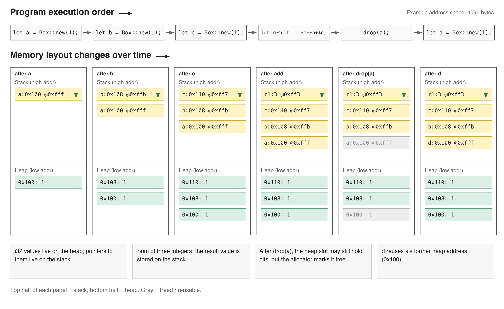

# 1.5 Memory Part 3 - A Deep Dive Into Rust Heap Memory Implementation

## 1.5.1. Heap Memory
- *Heap means chaos*, while the stack is relatively orderly.
- *The heap is a memory pool and is not tied to the current program’s call stack*, while the stack is tied to the current program’s call stack.
- *The heap is intended for types whose size is not known at compile time*, while data on the stack must have a known size at compile time.


As shown in the figure, the location of data on the heap and its size are both uncertain. A common pattern is that the stack holds a pointer to heap data.

What does it mean for size to be unknown at compile time?
- Some types can grow or shrink over time, such as `String` and `Vec<T>`. These types themselves are `Sized` (they are fixed-size structs on the stack), but the buffers they own live on the heap and can change size.
- Some other types do not change size, but the compiler cannot be told how much memory needs to be allocated for them.
- Another example is trait objects (see [Rust Guide 19.5.4. Dynamically Sized Types and the `Sized` Trait](https://someb1oody.github.io/RustGuide/en/Chapter-19/19.5/19.5._Advanced_Types.html)), which allow programmers to simulate some dynamic-language features — putting multiple types into one container.
- True *dynamically sized types (DSTs)* — also called unsized types — include slices such as `str` and `[T]`, as well as trait objects such as `dyn Trait`. `String` and `Vec<T>` are not DSTs; they *manage* dynamically sized heap data behind a `Sized` handle.

The heap allows you to explicitly allocate a contiguous block of memory. When you do that, you get a pointer to the beginning of that memory.

Values on the heap remain valid until you explicitly free them. This is useful when you want a value to outlive the current function frame (see [1.4. Memory Part 2](../1.4/1.4._Memory_Part_2_-_Stack_Memory,_Stack_Frames,_and_Stack_Pointer.md)). If a value is a function’s return value, the calling function can leave some space on its stack for the callee to write the value into before returning.

## 1.5.2. Heap Memory and Thread Safety
If you want to send a value to another thread, the current thread may not be able to share stack frames with that thread at all. In that case, you can store the value on the heap. Because heap allocations do not disappear when a function returns, you can allocate memory for a value in one place and pass a pointer to it to another thread, allowing that thread to operate on the value safely.

In other words: when you allocate heap memory, the resulting pointer has an unconstrained lifetime, and your program can keep the data alive for as long as it wants.

## 1.5.3. How Heap Memory Is Used
Variables on the heap must be accessed through pointers. Let’s look at an example:
```rust
fn main(){
    let a: i32 = 40; // Stack
    let b: Box<i32> = Box::new(60); // Heap
    let result = a + b;
    let result = a + *b;

    println!("{} + {} = {}", a, b, result);
}
```
Output:
```
error[E0277]: cannot add `Box<i32>` to `i32`
 --> src/main.rs:4:20
  |
4 |     let result = a + b;
  |                    ^ no implementation for `i32 + Box<i32>`
  |
  = help: the trait `Add<Box<i32>>` is not implemented for `i32`
help: consider dereferencing here
  |
4 |     let result = a + *b;
  |                      +
```
- `a` is of type `i32` and is stored on the stack.
- `b` is of type `Box<i32>` and is stored on the heap.

But this code definitely has a problem. The problem is `let result = a + b;`: heap data must be accessed through a pointer, and `b` is a pointer while `a` is a number, so their types are different and they cannot be added.

So we delete that line and change the original code to:
```rust
fn main(){
    let a: i32 = 40; // Stack
    let b: Box<i32> = Box::new(60); // Heap

    let result = a + *b;

    println!("{} + {} = {}", a, b, result);
}
```
`let result = a + *b;` uses `*` to *dereference* `b` and extract the value 60 pointed to by the pointer.

Output:
```
40 + 60 = 100
```

### How Rust Interacts With Heap Memory
*In Rust, the main way to interact with heap memory is through the `Box<T>` type.*

When we use `Box::new` to create an instance of type `Box<T>`, the value (the argument passed to `Box::new`) is placed on the heap, and the returned `Box<T>` is the pointer to that heap allocation. When the `Box` is dropped, the memory is freed.

If you forget to free heap memory, you will cause a memory leak. But sometimes programmers intentionally leak memory, for example when there is a read-only configuration that the whole program needs to access. In that case, `Box::leak` can be used to obtain a `'static` reference and deliberately leak the allocation.

Let’s look at an example:
```rust
use std::mem::drop;

fn main(){
    let a = Box::new(1);
    let b = Box::new(1);
    let c = Box::new(1);

    let result1 = *a + *b + *c;

    drop(a);

    let d = Box::new(1);

    let result2 = *b + *c + *d;

    println!("{} {}", result1, result2);
}
```
- You can manually free memory using the `std::mem::drop` function.

Let’s walk through the logic of this program:
- First, variables `a`, `b`, and `c` are declared, and their values are all `1` stored on the heap (`Box<i32>`).
- We dereference all three variables with `*` and add them together to get `result1`.
- After `result1` is obtained, the `drop` function is used to discard `a`.
- Then variable `d` is declared, and its value is also `1` stored on the heap (`Box<i32>`).
- We dereference `b`, `c`, and `d`, add them together, and get `result2`.
- Finally, `result1` and `result2` are printed.

Let’s use a diagram to see how memory changes while the program runs:


