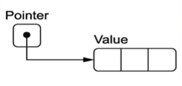
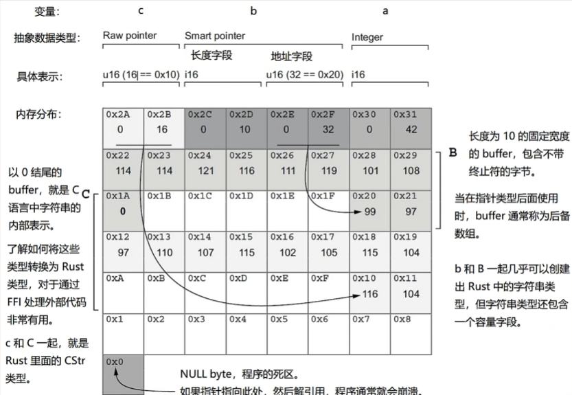

# 1.1 指针概览(上)：什么是指针、指针和引用的区别

## 1.1.1. 什么是指针
***指针是计算机引用无法立即直接访问的数据的一种方式。***

一个非常形象的类比就是书的目录，目录相当于指针，目录里面存的是对应内容所在的页码；在计算机中，指针存的是一个地址。在书里面我们通过目录的页码就可以找到具体的内容，在计算机里，我们通过指针里存的地址来找到我们想要访问的数据。下图是对指针一个形象的描述图：



数据在物理内存中(Random Access Memory，简称RAM)是分散着存储的。而为了找到具体的数据，我们需要一个**检索系统**，叫做**地址空间**。

指针会被编码为内存地址，使用`usize`类型（使用`usize`的原因在讲虚拟内存时会讲）的整数表示。一个*地址*会指向地址空间中的某个地方。

地址空间的范围是系统和CPU提供的*外观界面*（facade，指个系统或组件对外呈现的简化界面，隐藏了复杂的内部细节）。程序只知道有序的字节序列，并不会考虑系统中实际RAM的数量。

## 1.1.2. 名词解释
- 内存地址（又叫地址）：内存中指代单个字节的一个数。内存地址是汇编语言提供的抽象。
- 指针（又叫原始指针）：指向某种类型的一个内存地址。指针是高级语言提供的抽象。
- 引用：这里的引用指的是Rust中的引用（详见 [4.4. 引用与借用](../../Chapter-04/4.4/4.4._引用与借用.md)）。它就是指针，但如果它指向的数据是动态大小的类型（比如`str`或`[T]`），那么引用会提供一个整数来保证知道数据的边界在哪里以防止越界。引用是Rust语言提供的抽象。

## 1.1.3. Rust中的引用
Rust的引用相比于原始指针有很多的好处：
- 引用始终引用的是有效的数据

- 引用与`usize`的倍数是对齐的，如果不对齐CPU的操作就会变慢。Rust通过填充字节来保证引用能在内存上对齐。
  *对齐（Alignment）* 是指数据在内存中的存储地址必须是某个特定数值的倍数，以满足硬件的访问要求并提高效率。在Rust中，引用（如`&T`或`&mut T`）的地址总是对齐到`usize`的倍数，这意味着它的起始地址是系统字长（例如32位系统为4字节，64位系统为8字节）的整数倍。例如，在64位系统中，如果一个变量的地址是`0x1001`，它不是8的倍数，因此不能作为引用的地址；而`0x1000`或`0x1008`则是有效的引用地址。

- 引用可为动态大小的类型提供上述的保障。对于在内存中没有固定长度的类型，Rust会保证它的长度会被保存在内部指针的路径，这样就能知道知道数据的边界在哪里以防止越界。

## 1.1.4. Rust的引用和指针
看个例子：
```rust
static B: [u8; 10] = [99, 97, 114, 114, 121, 116, 111, 119, 101, 108];  
static C: [u8; 11] = [116, 104, 97, 110, 107, 115, 102, 105, 115, 104, 0];  
  
fn main() {  
    let a:i32 = 42;  
    let b:&[u8;10] = &B;  
    let c:&[u8;11] = &C;  
    println!("a = {}, b = {:p}, c = {:p}", a, b, c);  
}
```
- `b`是`B`的引用，`c`是`C`的引用
- `{:p}`指的是打印出变量的内存地址

输出：
```
a = 42, b = 0x1021d97e0, c = 0x1021d97ea
```

`a`、`b`和`c`在内存空间中的局部视图如下：


- 变量`b`和`c`是引用，在32位CPU上占4字节，在64位上占8字节（这里是4字节）
- `a`是`i32`类型，所以在内存上占4字节
- 静态变量`B`和`C`是两个数组，数组里的元素是`u8`，所以每个元素只占1字节

这这个代码想要实现的是`b`模拟智能指针，`c`模拟原始指针。这个例子还模拟得不够接近，后续会有更逼真的例子，现在就将就着吧。



这是一个我们虚构的拥有49个字节的地址空间，表示的是我们最终想要达到的效果，所以会和上文的代码有出入。我们一点一点来解析：
- `a`是一个整数，但由于图是我们假想的理想情况，所以说图里的类型是`i16`（占2字节），不是原来的`i32`
- `b`是一个智能指针，总长度是4字节，地址字段的长度只占2字节，也就是`u16`。长度字段占2字节，由于`B`是有10个元素的数组，所以在长度字段存储的值就是10。地址字段存储的32表示数据所在的起始位置，也就是0x20(32用16进制表示就是0x20)这个地方，长度是10，所以就是从0x20到0x29这块数据
- `c`是一个原始指针，占2个字节，字节里存的就是地址。这里存的是16，换成16进制就是0x10，所以`c`指向的数据从0x10开始，里面有11个元素，所以指向的是0x10到0x1A的数据块。
- 0x0是空字节(NULL byte)，是程序的死区。如果指针指向这个地方再进行解引用就会崩溃。

其他知识：
- 变量`c`是以0结尾的buffer，其实这是C语言中字符串的内部表示形式（C语言中的字符串是一个数组，以0结尾）。了解如何将这些类型转化为Rust中的类型对于通过*外部函数接口(Foreign Function Interface，简称FFI，后面会详细地讲)* 处理外部代码是非常有用的。
- 变量`c`和`C`在一起就叫做Rust里的`CStr`类型
- 变量`b`实际上是一个长度为10，固定长度的buffer，但这个buffer不带终止符（不以0结尾）。当这个buffer在指针类型后面使用时会被称作*后备数组*
- 变量`b`和`B`在一起几乎可以创建出Rust中的字符串类型，但字符串类型还包含一个容量(capacity)字段。也就是说，组成Rust字符串类型需要长度、地址和容量三个字段。
