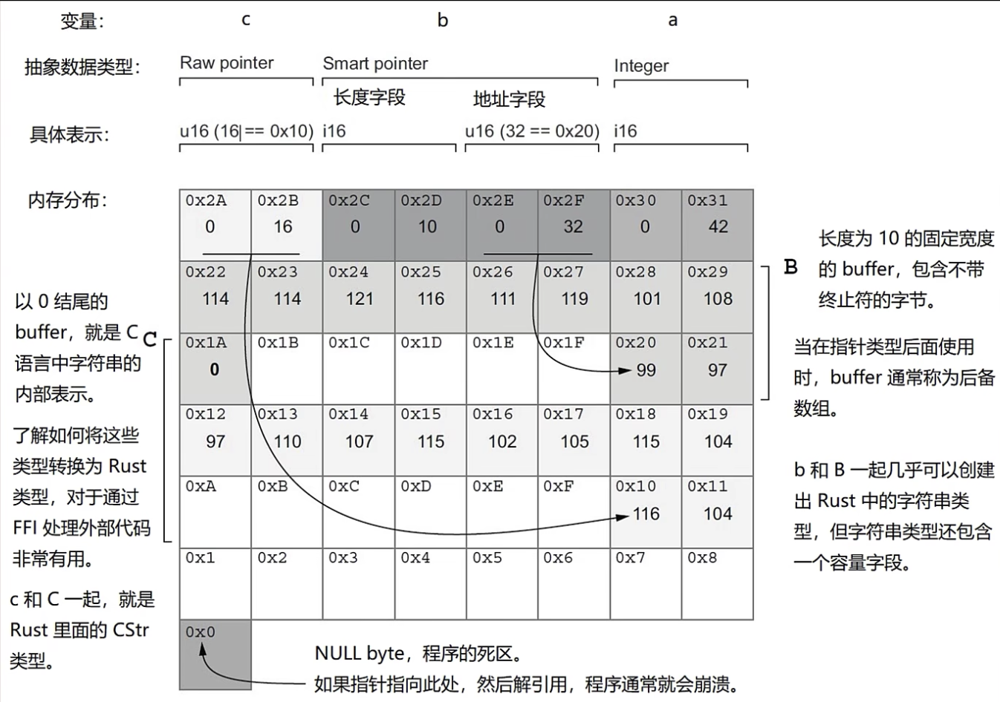

# 1.2 指针概览(下)：原始指针及Rust里的各类指针

## 1.2.1. 一点回顾
[上一节](../1.1/1.1._指针概览(上)：什么是指针、指针和引用的区别.md)中我们使用了引用的例子来模拟指针，但模拟的效果差了很多，我们想要区分原始指针(*raw pointer*)和智能指针(*smart pointer*)在内部的区别，具体想要的效果如下：



这个图我在上一篇文章 [1.1. 指针概览(上)](../1.1/1.1._指针概览(上)：什么是指针、指针和引用的区别.md) 中有过详细解释，这里就不再作介绍。

## 1.2.2. Rust的引用和指针
这篇文章我们会换一个更逼真的例子，使用更复杂的类型展示指针内部的区别:
```rust
use std::mem::size_of;  
  
static B: [u8; 10] = [99, 97, 114, 114, 121, 116, 111, 119, 101, 108];  
static C: [u8; 11] = [116, 104, 97, 110, 107, 115, 102, 105, 115, 104, 0];  
  
fn main() {  
    let a: usize = 42;  
    let b: Box<[u8]> = Box::new(B);  
    let c: &[u8; 11] = &C;  
      
    println!("a (unsigned 整数)");  
    println!("地址: {}", &a);  
    println!("大小: {:?} bytes", size_of::<usize>());  
    println!("值: {:?}\n", a);  
  
    println!("b (装在Box里)");  
    println!("地址: {:p}", &b);  
    println!("大小: {:?} bytes", size_of::<Box<[u8]>>());  
    println!("指向: {:p}\n", b.as_ptr());  
  
    println!("c (C的引用)");  
    println!("地址: {:p}", &c);  
    println!("大小: {:?} bytes", size_of::<&[u8; 11]>());  
    println!("指向: {:p}\n", c);  
      
    println!("B (10 bytes的数组):");  
    println!("地址: {:p}", &B);  
    println!("大小: {:?} bytes", size_of::<[u8; 10]>());  
    println!("值: {:?}\n", B);  
  
    println!("C (11 bytes的数组):");  
    println!("地址: {:p}", &C);  
    println!("大小: {:?} bytes", size_of::<[u8; 11]>());  
    println!("值: {:?}\n", C);  
}
```
- 使用了`std::mem::size_of`函数，用于获取各类型所占的内存空间（以字节为单位）
- 静态变量`B`和`C`的大小和内容与[上一篇文章](../1.1/1.1._指针概览(上)：什么是指针、指针和引用的区别.md)一样
- `a`是`usize`类型，值为42
- `b`使用了智能指针`Box<T>`来包裹的`B`，这时候`Box<T>`里面值的所有权就转移到`Box<T>`上了
- `c`是一个普通的引用
- 每个变量都打印了地址，使用取地址符号`&`来实现；每个变量也都打印了它们在内存中和所占的字节数，使用`std::mem::size_of`函数来实现
- 我们打印出了`a`、`b`、`c`、`B`和`C`，但是由于类型不同其表示的意义也不一样：`a`、`B`和`C`会打印实际存储的值；`b`和`c`的“指向”行会打印它们所引用数据的地址（`b.as_ptr()`以及对`c`使用`{:p}`）

输出：
```
a (unsigned integer)
address: 42
size: 8 bytes
value: 42

b (inside a Box)
address: 0x16d1aa5f0
size: 16 bytes
points to: 0x1031f1c10

c (reference to C)
address: 0x16d1aa600
size: 8 bytes
points to: 0x102c8aeba

B (10-byte array):
address: 0x102c8aeb0
size: 10 bytes
value: [99, 97, 114, 114, 121, 116, 111, 119, 101, 108]

C (11-byte array):
address: 0x102c8aeba
size: 11 bytes
value: [116, 104, 97, 110, 107, 115, 102, 105, 115, 104, 0]
```
- 我的电脑是64位的所以`usize`的`a`所占的内存是8字节
- `b`的类型是`Box<T>`，一个智能指针，所以它要占16字节——两个`usize`类型所占的大小（一个`usize`字段用于存储指针，另一个用于存储长度）
- `c`是一个普通的引用，一个指针，所以占8字节——一个`usize`类型的大小（用于存储指针）
- `B`是一个有10个元素的数组，元素类型是`u8`，一个`u8`占一字节，所以10个`u8`就占10字节
- `C`是一个有11个元素的数组，元素类型是`u8`，一个`u8`占一字节，所以11个`u8`就占11字节

我们真正需要注意的是`c`和`b`所存储的指针：
- `c`存储指向`C`的指针，输出中我们可以看到`c`存储的指针是0x102c8aeba，而`C`所处的地址正是0x102c8aeba，对应上了
- `b`存储指向堆上`B`字节*副本*的指针（由`Box::new(B)`创建）。`b`存储的指针是0x1031f1c10，但是静态变量`B`所在的地址是0x102c8aeb0，并没有对应上，是为什么呢？
  这是因为`B`是放在静态内存里的，而`Box<[u8]>`会在堆上另分配一块缓冲区并把数组拷过去。由于`b`并不指向静态的`B`，而是指向堆上的那块分配，所以地址对不上。

我们再讲一个例子，还是刚才的`B`和`C`两个静态变量，我们在[前一篇文章](../1.1/1.1._指针概览(上)：什么是指针、指针和引用的区别.md)讲过`B`和`C`实际上是文本内容，但是没有进行解码，所以是以`u8`的格式存储在变量里的，这里我们就来实现解码操作。这样做同时还能创建啊一个与理想状态（在 1.2.1. 一点回顾 中出现的那张图）更加相似的内存地址布局：
```rust
use std::borrow::Cow;  
use std::ffi::CStr;  
use std::os::raw::c_char;  
  
static B: [u8; 10] = [99, 97, 114, 114, 121, 116, 111, 119, 101, 108];  
static C: [u8; 11] = [116, 104, 97, 110, 107, 115, 102, 105, 115, 104, 0];  
  
fn main() {  
    let a = 42;  
    let b: String;  
    let c: Cow<str>;  
      
    unsafe {  
        let b_ptr = &B as *const u8 as *mut u8;  
        b = String::from_raw_parts(b_ptr, 10, 10);  
          
        let c_ptr = &C as *const u8 as *const c_char;  
        c = CStr::from_ptr(c_ptr).to_string_lossy();  
    }  
      
    println!("a: {}, b: {}, c: {}", a, b, c);  
}
```
- `std::borrow::Cow`是一个智能指针，`Cow`指的是Clone on write，意思就是需要写入时才进行克隆，平时只需要读的时候就不用了

- `std::ffi::CStr`类似于C语言的字符串类型，它允许Rust读取以0结尾的字符串

- `std::os::raw::c_char`是平台上 C 语言`char`类型的别名（常常是`i8`，有时是`u8`）。现代代码更推荐使用`std::ffi::c_char`。

- `main`函数中的变量`a`、`b`和`c`分别是`i32`、`String`和`Cow<str>`类型

- 由于下面的操作需呀使用到原始指针（例如可变原始指针`*mut T`和不可变原始指针`*const T`），所以得写在`unsafe`块里：

  - 第一步想要获得`B`的可变原始指针，也就是转化为`*mut u8`，但肯定不能直接获得，所以我们得先写`&B`获得`B`的引用，然后再使用`as *const u8`转化为指向的数据为`u8`的不可变原始指针，再使用`as *mut u8`转化为可变原始指针。

  - 为什么要获得可变的原始指针呢？因为我们需要使用`String::from_raw_parts`函数把数字解码为文本。它有三个参数：`buf`、`length`和`capacity`（对应`String`类型这个智能指针的三个字段）。`buf`处我们写数据的原始引用也就是`b_ptr`，`length`和`capacity`都写10因为我们知道里面存了10个元素。这步之后`B`所对应的字符串就解码出来了。

  - 对`C`也进行类似的操作，不同之处在于`C`以元素`0`结尾，是C语言存储字符串的方式，所以代码与对`B`进行解码稍有不同：我们得获得`C`的不可变原始指针，类型还得从`u8`变到`c_char`（平台相关，常常是`i8`），所以先写`&C`获得引用，再写`as *const u8`获得原始指针，最后写`as *const c_char`将类型转为`c_char`。

  - 使用`CStr::from_ptr`函数，把`c_ptr`这个`C`的`c_char`类型不可变原始指针传进去，再使用`to_string_lossy`方法即可以得到解码后的字符串。

- 最后我们把`a`、`b`和`c`都打印出来。

输出：
```
a: 42, b: carrytowel, c: thanksfish
```
- 打印出来的这一行是：
  - `a`的值是42可以直接打印
  - `b`解码出来的值是`carrytowel`
  - `c`解码出来是`thanksfish`

- 打印之后，当`b`被丢弃时进程仍会异常退出。在某些平台上你可能还会看到分配器诊断信息（例如 macOS 的 `malloc: *** error for object ...: pointer being freed was not allocated`）；本次本地运行中 abort 没有产生额外的 stderr 文本。

*这是因为`String::from_raw_parts`会接管一块必须由分配器分配出来的内存；这里我们却把它指向了静态数据，于是分配器会尝试释放并不属于它的内存。*

## 1.2.3. 原始指针(raw pointer)
### 什么是原始指针
unsafe Rust提供了两种类似于引用的新型指针，它们叫做*原始指针*或者*裸指针*，英文是raw pointer。只有*使用原始指针*时才需要放到`unsafe`块里，因为可能会出现问题，*单创建一个原始指针*并不会产生问题，故不需要放到`unsafe`块里。

和引用类似，这种原始指针要么是可变的要么是不可变的：
- 可变的：`*mut T`
- 不可变的：`*const T`，意味着不能通过该指针修改其指向的值（除非先把它转换成`*mut T`）。
*注意：这里面的`*`是类型的一部分不代表解引用，`*const T`这三个标记放在一起才是一个类型，比如`*const String`*

`*const T`和`*mut T`的差别很小，可以相互自由的转换。Rust的引用(不论是`&mut T`还是`&T`)在编译阶段都会被编译器转为原始指针，这意味着**无需进入`unsafe`块就能获得原始指针的性能**。

引用和原始指针的不同之处在于：
- 允许通过*同时具有不可变和可变指针*或*多个指向同一位置的可变指针*来忽略借用规则（借用规则详见 [4.4. 引用与借用](../../Chapter-04/4.4/4.4._引用与借用.md)）
- 原始指针无法保证能指向合理的内存，而引用可以。
- 原始指针允许为`null`
- 原始指针不实现任何自动清理功能

我们看一个转化为原始指针的简单例子（刚才的例子稍微又些复杂）：
```rust
fn main(){
	let a: i64 = 42;
	let a_ptr: *const i64 = &a as *const i64;

	println!("a: {}({:p})", a, a_ptr);
}
```

输出：
```
a: 42(0x16f30a620)
```

### 解引用(dereference)
解引用指的是指针从RAM内存提取数据的过程叫做*对指针进行解引用(dereferencing a pointer)*。

我们再看一个把引用转化为原始指针的例子：
```rust
fn main() {  
    let a: i64 = 42;  
    let a_ptr: *const i64 = &a as *const i64;  
    let a_addr: usize = unsafe { std::mem::transmute(a_ptr) };  
      
    println!("a: {}({:p}..0x{:x})", a, a_ptr, a_addr + 7);  
}
```
- `a`是`i64`类型，值是42
- `a_ptr`是`a`的不可变原始指针
- `a_addr`在`unsafe`块里（涉及使用原始指针的代码需要放到`unsafe`块里）使用`std::mem::transmute`函数把`a_ptr`转化为`usize`类型
- 输出时先输出`a`的值，再输出指向`a`的原始指针，最后输出`addr + 7`的值

输出：
```
a: 42(0x16d9ea608..0x16d9ea60f)
```

### 关于原始指针的一些提醒
- 在底层，引用(`&mut T`和`&T`)最终会被实现为原始指针。但引用带有额外的保障，应该始终作为首选项使用。
- 访问原始指针的值总是不安全的
- 原始指针不拥有值的所有权，在访问时编译器不会检查数据的合法性
- Rust允许多个原始指针指向同一数据，但无法保证共享数据的合法性

### 使用原始指针的情况
有的时候原始指针不得不被使用，比如：
- 某些系统或第三方库需要使用，例如与C交互
- 共享对某些内容的访问至关重要，运行时性能要求高

## 1.2.4. Rust指针生态
- 原始指针是unsafe的
- 智能指针倾向于包装原始指针，附加更多的能力（语义）。也就是不仅仅是对内存地址解引用，还有其它能力，具体如下：

| 名称              | 简介                                               | 强项                         | 弱项                       |
| --------------- | ------------------------------------------------ | -------------------------- | ------------------------ |
| 原始指针Raw Pointer | `*mut T` 和 `*const T`，自由基，闪电般快，极其 unsafe         | 速度、与外界交互                   | Unsafe                   |
| `Box<T>`        | 可把任何东西都放在 `Box` 里。可接受几乎任何类型的长期存储。新的安全编程时代的主力军。   | 将值集中存储在 Heap               | 大小增加                     |
| `Rc<T>`         | 是 Rust 的能干而睿智的簿记员。它知道谁借了什么，何时借了什么。               | 对值的共享访问                    | 大小增加；运行时成本；线程不安全         |
| `Arc<T>`        | 是 Rust 的大使。它可以跨线程共享值，保证这些值不会相互干扰。                | 对值的共享访问；线程安全               | 大小增加；运行时成本               |
| `Cell<T>`       | 变”态“专家，具有改变不可变值的能力                               | 内部可变性；与`T`同等大小            | 线程不安全；不能直接拿到内部值的引用      |
| `RefCell<T>`    | 对不可变引用执行改变，但有代价                                  | 内部可变性；可与 Rc、Arc 嵌套使用       | 大小增加；运行时成本；线程不安全；缺乏编译时保障 |
| `Cow<T>`        | 封闭并提供对借用数据的不可变访问，并在需要修改或所有权时延迟克隆数据               | 只读访问时避免写入                  | 大小可能会增大                  |
| `String`        | 可处理可变长度的文本，展示了如何构建安全的抽象。                         | 动态按需增长；运行时保证正确编码           | 过度分配内存大小                 |
| `Vec<T>`        | 程序最常用的存储系统；它在创建和销毁值时保持拥有序。                       | 动态按需增长                     | 过度分配内存大小                 |
| `RawVec<T>`     | `Vec<T>` 和其动态大小类型的基石；知道如何按需给数据提供一个家。             | 动态按需增长；与内存分配器一起配合寻找空间      | **不直接适用于你的代码**           |
| `Unique<T>`     | 作为值的唯一所有者，可保证拥有完全控制权。                            | 需要独占值的类型（如`String`）的基础     | **不适合直接用于应用程序代码**        |
| `NonNull<T>`    | 许多标准库智能指针内部使用的非空原始指针包装                         | 对`T`协变；可用`Option<NonNull<T>>`做niche优化 | 解引用仍不安全；**通常不直接用于应用程序代码** |
