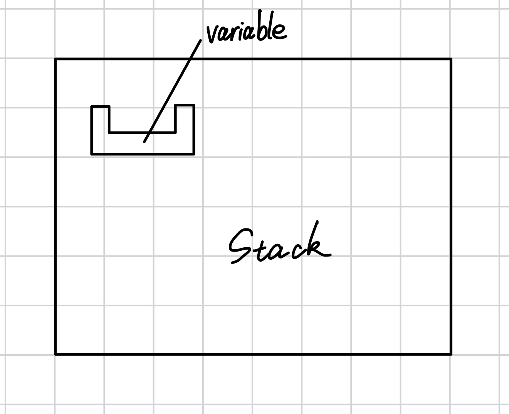
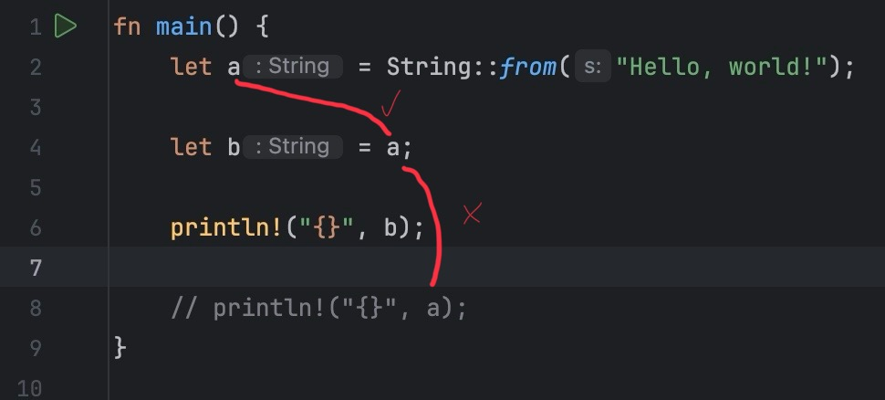

# 1.3 内存 Pt.1：各类概念的定义及变量的高级模型和低级模型

## 1.3.1. 值
在讲内存之前我们得先讲三个概念，第一个是值。值指的是*类型 + 类型值域中的一个元素*。

例如`true`，它的类型是bool类型，它的值域里就两个值——一个`true`，一个`false`。值指的是*类型 + 类型值域中的一个元素*，`true`的值就是*bool类型 + 值域中的元素`true`*。

*通过值的类型表示可以转化为字节序列*：
- 举个例子，`u8`类型的6，在内存中的表示就是`0x06`
- 再看一个例子，`str`的"Hello World"字符串，它就是字符串值域里的一个值，它的表示是`utf-8`编码
*注意：值的含义是独立于存储它字节的位置的，也就是值和存储它的位置没有直接关系，它们是独立的两个概念*

## 1.3.2. 变量
值会存储到一个地方（或者说这个地方可以容纳值），具体就是堆内存、栈内存或者其他地方。最常见的存储值的地方就是变量，它是*栈内存*上一个被命名的槽（用于存储值）。



## 1.3.3. 指针
指针是一个值，值里面存放的是一块内存的地址，指针指向某个地方（地址所对应的内存）。

指针可以被 *解引用(dereference)* 来访问它指向的内存里存放的值。

可以把同一个指针放在不同的变量里，也就是说多个变量可以间接地引用内存上的同一块区域，也就是相同的底层的值。


## 1.3.4. 深入变量
变量可以被分为两种模型：
- 高级模型：生命周期、借用...
- 低级模型：不安全代码、原始指针...

### 变量的高级模型
*变量实际上就是给值一个名称。* 当值被赋给变量时，这个值从那时起就由该变量命名了。

举个例子:
```rust
let variable = 1234;
```


如图，1234这个数据此时就由`variable`这个变量命名了。

当变量被访问时，可以从变量的上次访问到这次访问画一条线，从而在两次访问中建立依赖关系。如果变量被移动了，就不能从它那里画线。

这么说你可能不明白，看个图你就懂了：



声明`a`（第2行）算一次访问，把`a`赋给`b`（第4行）算另一次，但是和打印出`a`（第8行）之间不能画线，因为在此之前变量已经移动了（第4行）。

*在变量的高级模型中*，变量只会在它持有合法值的时候才存在。如果变量的值没有初始化，或者已经被移动了，那就无法使用画线的方法。

使用这种模型，整个程序会由许多依赖线组成，这些线叫*flow*。每个flow都在追踪一个值的特定实例的生命周期。当有分支存在时，flow可以分叉或合并，并且每个分叉都在追踪该值的不同的生命周期。

在程序中的任何给定点，编译器可以检查所有的flow是否可以互相兼容，并行存在。例如：
- 一个值不可能有两个具有可变访问的并行flow
- 一个flow借用了一个值，但却没有flow拥有该值

### 变量的低级模型
变量会给那些可能（不）存储合法值的内存地址进行命名。

可以把变量想象为值的槽：当你赋值时槽就装满了，而它里面原来的值（如果有的话）就被丢弃或替换了。当访问它时，编译器会检查槽是不是空的。如果是，那么就说嘛变量未初始化或它的值被移动了。

*指向变量的指针其实是指向这个变量的幕后内存*，通过解引用可以获得它的值。

**注意：在本例中，我们忽略CPU寄存器，并将其视为优化。实际上，如果变量不需要内存地址，编译器可以使用寄存器而不是内存区域来存放变量。**
