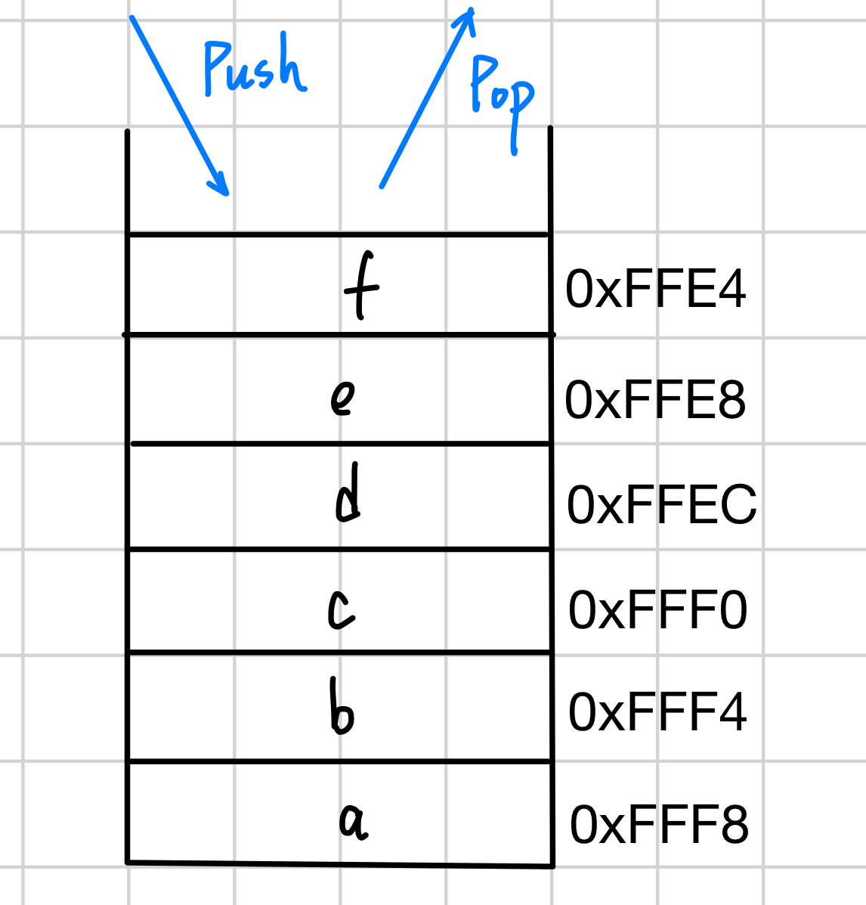

# 1.4 内存 Pt.2：栈内存、栈帧(stack frame)、栈指针(stack pointer)

## 1.4.1. 内存区域
程序有很多的内存区域，并不都是在DRAM上的。*三个比较重要的区域是栈内存stack、堆内存heap和静态内存staic。*

**栈内存和堆内存相对比，栈内存更快堆内存更慢。**

## 1.4.2. 栈内存(stack)
有这么一个公理，叫做：“有疑问时，首选Stack”。但是如果想把数据放在栈内存，编译器就必须知道类型的大小。换句话说：“有疑问时，首选实现了Sized的类型”（关于Sized trait的详细内容见[【Rust自学】19.5.4. 动态大小和和`Sized` trait](https://someb1oody.blog.csdn.net/article/details/145427064)）。

Stack是一段内存，程序把它作为一个暂存空间，用于函数调用。

为什么会叫stack呢？因为在stack上的条目是LIFO(Last In First Out，后进先出)



### Stack Frame
*每个函数被调用，在stack的顶部都会分配一个连续的内存块，叫做stack frame(栈帧)。*


在接近stack底部附近是`main`函数的frame，随着函数的调用，其余的frames都推到了stack上。

函数的frame包含着函数里的所有变量，以及函数所带的参数。当函数返回时，它的frame就被回收了。

构成函数本地变量值的那些字节不会被立即擦除，但访问它们是不安全的，因为它们可能会被后续的函数调用所重写（如果后续函数调用的frame与回收的这个有重合的话）。但即使没有被重写，它们也可能包含无法使用的值。例如函数返回后被移动的值。 

Stack Frame也叫*activation frames*或*allocation record*。只有activation frames被分配在stack上时才叫stack frame。

每个stack frame的大小是不同的。在函数调用期间，stack frame会包含函数的状态。当一个函数在另外一个函数内调用时，原来的函数的值会被及时冻结。

stack fram为函数参数，指向原来调用栈的指针，以及本地变量（不包括在堆内存上分配的数据）提供空间。

**stack的主要任务在于为本地变量创造空间，原因在于stack里所有变量都是紧挨着的，找起来更快。**

看个例子：
```rust
fn main() {  
    let pw = "justok";  
    let is_string = is_strong(pw);  
}  
  
fn is_strong(password: String) -> bool {  
    password.len() > 5  
}
```
输出：
```
error[E0308]: mismatched types
 --> src/main.rs:3:31
  |
3 |     let is_string = is_strong(pw);
  |                     --------- ^^ expected `String`, found `&str`
  |                     |
  |                     arguments to this function are incorrect
  |
note: function defined here
 --> src/main.rs:6:4
  |
6 | fn is_strong(password: String) -> bool {
  |    ^^^^^^^^^ ----------------
help: try using a conversion method
  |
3 |     let is_string = is_strong(pw.to_string());
  |                                 ++++++++++++
```
问题很明显，`pw`是`&str`类型的，`is_strong`函数的参数是`String`类型。

我们的目标就是让`is_strong`函数兼容`&str`和`String`类型。这个目标看起来挺简单但其实有点麻烦：*`String`拥有堆上的缓冲区，而`&str`只是指向某段UTF-8字节的胖指针，这些字节可能在静态内存、堆上或其他地方*，这两个类型的转换不简单。

看看修改后的代码：
```rust
fn is_strong<T: AsRef<str>>(password: T) -> bool {  
    password.as_ref().len() > 5  
}
```
这么写就是把传进来的参数作为到`str`的引用。

也可以这么改：
```rust
fn is_strong<T: Into<String>>(password: T) -> bool {  
    password.into().len() > 5  
}
```
这么写就是把传进来的参数转化为`String`。但是这些写法都涉及到了比较多的转化。

还可以这么写：
```rust
use std::fmt::Display;

fn is_strong<T: Display>(password: T) -> bool {  
    password.to_string().len() > 5  
}
```
通过`to_string`方法把参数转化成`String`类型再操作。这个操作比上一个更慢。

### Stack Pointer
*随着程序的执行，CPU里有一个游标会随着更新，它反映当前stack frame的当前地址，这个游标就叫做stack pointer（stack指针）。*


随着函数内不断地调用函数，stack就会增长（stack pointer从stack frame开始），而stack pointer的值就会减少（越接近stack frame的地方内存地址更大）；当函数返回，stack pointer的值会增加（当函数返回时，它的frame就被回收了，游标向stack frame接近，值就变大）。

### Stack Frame的消失
stack frames会最终消失的这个事实与Rust生命周期的概念是密切相关的。任何存储在stack上的变量在frame消失后就无法访问了。

所以，*任何到stack上的变量的生命周期最多只能与frame的生命周期一样长*。
