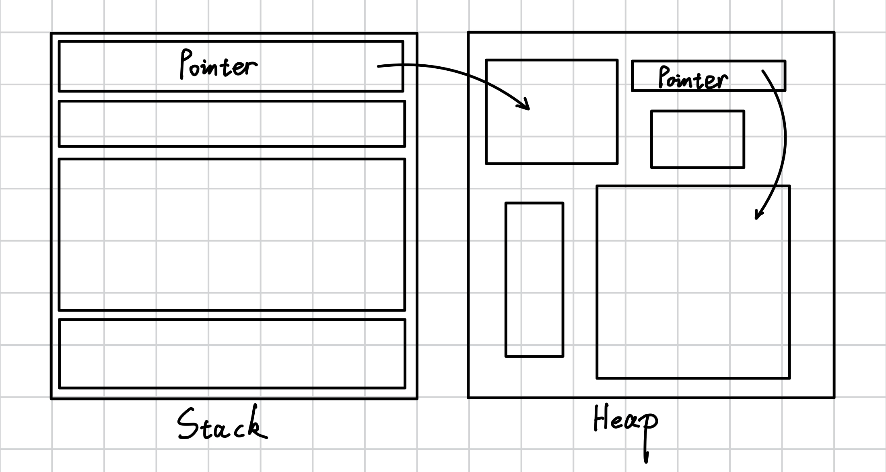
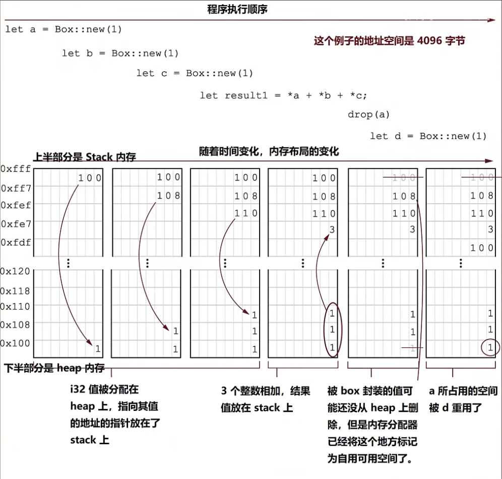

# 1.5 内存 Pt.3：深入探究Rust堆内存底层实现

## 1.5.1. 堆内存(Heap)
- *Heap意味着混乱*，而stack则相对比较整齐。
- *Heap是一个内存池，并没有绑定到当前程序的调用栈*，而stack绑定到当前程序的调用栈。
- *Heap是为在编译时没有已知大小的类型准备的*，而stack上的数据在编译时大小必须已知。



如图，heap上的数据存放的位置和自身的大小都是不一定的，比较常见的情况是stack有一个指针指向heap上的数据。

什么叫在编译时大小不已知？
- 一些类型会随着时间变大或变小，例如`String`、`Vec<T>`。这些类型本身是`Sized`的（在栈上是固定大小的结构体），但它们拥有的缓冲区在堆上，可以改变大小。
- 另一些类型的大小不会改变，但是无法告诉编译器需要分配多少内存
- 另一个例子是trait对象（详见 [【Rust自学】19.5.4. 动态大小和和`Sized` trait](https://someb1oody.blog.csdn.net/article/details/145427064)），它允许程序员模拟一些动态语言的特性——将多个类型放进一个容器
- 真正的*动态大小类型(dynamically sized types，简称DST)*——也叫unsized types——包括切片（如`str`、`[T]`）以及trait对象（如`dyn Trait`）。`String`和`Vec<T>`本身不是DST；它们是通过一个`Sized`句柄来*管理*堆上动态大小数据的。

Heap允许你显示地分配连续的内存块。当这么做时，你就会得到一个指针，它指向内存开始的地方。

Heap中的值会一直有效，直到你对它显式地释放。如果你想让值活得比当前函数frame（详见 [1.4. 内存 Pt.2](../1.4/1.4._内存_Pt.2：栈内存、栈帧(stack_frame)、栈指针(stack_pointer).md)）的生命周期还长，就很有用。如果值是函数的返回值，那么调用函数可以在它的stack上留一些空间给被调用函数让它把值在返回前写入进去。

## 1.5.2. 堆内存与线程安全
如果想要把值送到另一个线程，当前线程可能根本无法与那个线程共享stack frames，你就可以把它存在堆内存上。因为函数返回时堆内存上的分配不会消失，所以你在一个地方为值分配内存，把指向它的指针传给另一个线程，就可以让那个线程安全地操作于这个值。

换一种说法：当你分配堆内存时，结果指针会有一个无约束的生命周期，你的程序想让数据活多久都行。

## 1.5.3. 堆内存的交互机制
堆内存上的变量必须通过指针访问。看个例子：
```rust
fn main(){  
    let a: i32 = 40; // Stack  
    let b: Box<i32> = Box::new(60); // Heap  
    let result = a + b;  
    let result = a + *b;  
      
    println!("{} + {} = {}", a, b, result);  
}
```
输出：
```
error[E0277]: cannot add `Box<i32>` to `i32`
 --> src/main.rs:4:20
  |
4 |     let result = a + b;
  |                    ^ no implementation for `i32 + Box<i32>`
  |
  = help: the trait `Add<Box<i32>>` is not implemented for `i32`
help: consider dereferencing here
  |
4 |     let result = a + *b;
  |                      +
```
- `a`是`i32`类型，放在栈内存上的
- `b`是`Box<i32>`类型，放在堆内存上的

但是这么写肯定是有问题的，问题出在`let result = a + b;`上：堆内存上的数据必须通过指针来访问，`b`是指针，`a`是数字，两者类型不同肯定不能相加。

所以我们删掉这句话把原代码改成：
```rust
fn main(){  
    let a: i32 = 40; // Stack  
    let b: Box<i32> = Box::new(60); // Heap  
  
    let result = a + *b;  
      
    println!("{} + {} = {}", a, b, result);  
}
```
`let result = a + *b;`通过`*`对`b`进行了*解引用*，把指针指向的值60取出来了。

输出：
```
40 + 60 = 100
```

### Rust与堆内存的交互方式
*Rust里与堆内存交互的主要方式就是`Box<T>`类型。*

当我们使用`Box::new`函数创建类型为`Box<T>`的实例时，值（传进`Box::new`函数的参数）就会被放在堆内存上，返回的(`BOx<T>`)就是指向堆内存上的指针。当`Box`被丢弃时，内存就会被释放。

如果忘记释放堆内存，就会导致内存泄漏。但有时候程序员会故意让内存泄漏，例如有一个只读的配置，整个程序都需要访问它。这时候就可以通过`Box::leak`得到一个`‘static`引用，从而显式地让其进行泄露。

看个例子：
```rust
use std::mem::drop;  
  
fn main(){  
    let a = Box::new(1);  
    let b = Box::new(1);  
    let c = Box::new(1);  
      
    let result1 = *a + *b + *c;  
      
    drop(a);  
      
    let d = Box::new(1);  
      
    let result2 = *b + *c + *d;  
      
    println!("{} {}", result1, result2);  
}
```
- 使用`std::mem::drop`函数可以手动释放

我们讲讲这个程序的逻辑：
- 首先声明了变量`a`、`b`和`c`，值都是存储在堆内存上的1（`Box<i32>`类型）
- 使用`*`对三个变量都进行解引用然后相加得到`result1`
- 得到`result1`之后使用`drop`函数直接抛弃了`a`
- 然后声明了变量`d`，值是存储在堆内存上的1（`Box<i32>`类型）
- 使用对`*`三个变量(`b`、`c`和`d`)进行解引用然后相加得到`result2`
- 打印出`result1`和`result2`

我们用一张图来看看这个程序执行中内存的变化：


